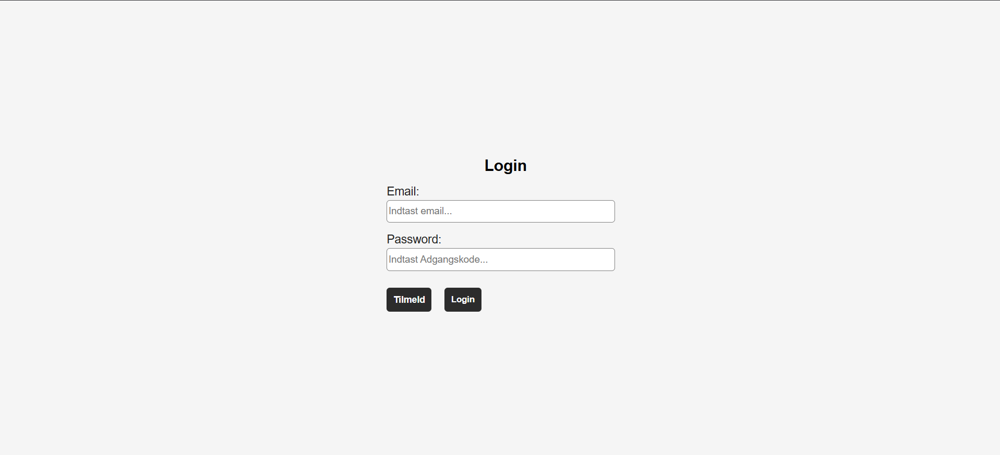
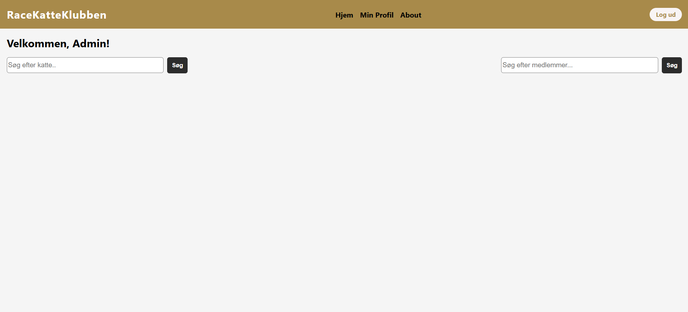
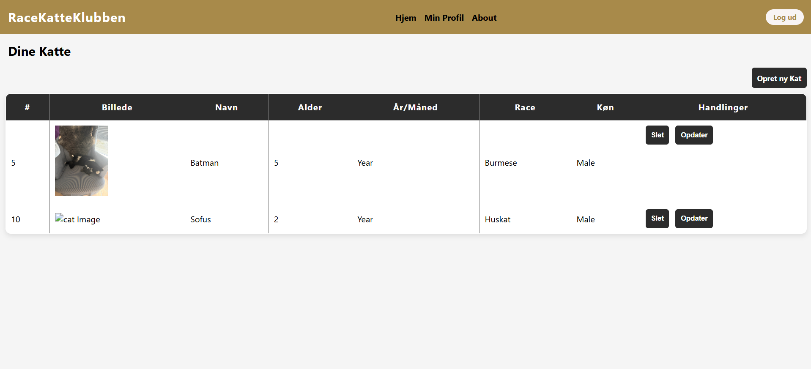

# RaceKatteKlubben
> Dette er et projekt med fokus på at udvikle en applikation til RaceKatteKlubben, en klub for katteentusiaster. Applikationen giver medlemmerne mulighed for at tilføje redigere og slette katteprofiler, samt se en liste over alle katte i klubben. Dertil også søge efter andre medlemmer i klubben.

## Funktioner
- Opret, rediger og slet katteprofiler
- Søge efter alle katte i klubben
- Søg efter medlemmer i klubben
- Brugervenligt interface

## Arkitektur
Applikationen er bygget ud fra en Model-View-Controller (MVC) arkitektur, hvor:
- **Model**: Repræsenterer data og forretningslogik (Katte, Medlemmer)
- **View**: Håndterer brugergrænsefladen (HTML / Thymeleaf, CSS)
- **Controller**: Håndterer brugerinput og opdaterer modellen og view

Yderligere har fokus været på at bruge **Clean Architecture** principper for at sikre en klar adskillelse af ansvar og gøre koden mere vedligeholdelsesvenlig.

## Screenshots
### Login

### Home Page

###  Katteliste

## Teknologier
- Java 24
- Spring Boot for UI
- MySQL for database
- JUnit for testning

## Installation
1. Klon dette repository: `git clone https://github.com/jak015/RaceKatteKlubben.git`
2. Opret en MySQL-database og opdater `application.properties` med dine databaseoplysninger.
3. Kør schema.sql for at oprette de nødvendige tabeller i din database.
4. Kør applikationen
5. Åbn din browser og gå til `http://localhost:8080/auth/login` for at få adgang til applikationen.